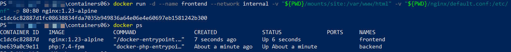

# Лабораторная работа: Взаимодействие контейнеров

## Цель работы

Выполнив данную работу, студент сможет управлять взаимодействием нескольких контейнеров.

## Задание

Создать PHP-приложение на базе двух контейнеров: **nginx** и **php-fpm**.

## Описание выполнения работы

- В корневой директории `containers06` создан каталог `mounts/site/`, в котором расположен PHP-проект.
- Создан файл `nginx/default.conf` со следующим содержимым:

```nginx
server {
    listen 80;
    server_name _;
    root /var/www/html;
    index index.php;

    location / {
        try_files $uri $uri/ /index.php?$args;
    }

    location ~ \.php$ {
        fastcgi_pass backend:9000;
        fastcgi_index index.php;
        fastcgi_param SCRIPT_FILENAME $document_root$fastcgi_script_name;
        include fastcgi_params;
    }
}
```

- Создана локальная сеть для контейнеров командой:

```bash
docker network create internal
```


- Созданы два контейнера:
  - backend на базе образа `php:7.4-fpm`
    1. Примонтирована директория `mounts/site` в `/var/www/html`, командой `-v "${PWD}/mounts/site:/var/www/html"` (`${PDW}` - обозначение текущей директории)
    
    2. Работает в сети `internal`
  - frontend на базе образа `nginx:1.23-alpine`
    1. Примонтирована директория `mounts/site` в `/var/www/html`, командой `-v "${PWD}/mounts/site:/var/www/html"` (`${PDW}` - обозначение текущей директории)
    2. Примонтирован файл `nginx/default.conf` в `/etc/nginx/conf.d/default.conf`, командой `-v "${PWD}/nginx/default.conf:/etc/nginx/conf.d/default.conf"`
    
    3. Порт 80 контейнера проброшен на порт 80 хоста, используя `-p 80:80`
    4. Работает в сети `internal`

- Проверена работа сайта в браузере, перейдя по адресу `http://localhost`


### Ответы на вопросы

- Каким образом в данном примере контейнеры могут взаимодействовать друг с другом?

Контейнеры взаимодействуют через общую сеть — они подключены к одной сети (internal), поэтому могут обращаться друг к другу по именам контейнеров.

- Как видят контейнеры друг друга в рамках сети internal?

Контейнеры "видят" друг друга по DNS-именам, совпадающим с именами контейнеров (например, backend), внутри сети.

- Почему необходимо было переопределять конфигурацию nginx?
  1. Задать корневую директорию (root /var/www/html)

  2. Указать fastcgi_pass backend:9000 — передача запросов на выполнение PHP в контейнер backend.

## Выводы

В ходе данной работы были приобретены навыки управления взаимодействием нескольких контейнеров через локальную сеть. В качестве примера использованы контейнеры на базе образов `php:7.4-fpm` и `nginx:1.23-alpine`. Контейнеры были успешно связаны, и, как результат, сайт стал доступен в браузере по адресу `http://localhost`.

## Библиография

`https://moodle.usm.md/mod/assign/view.php?id=284365`
`https://chatgpt.com`
